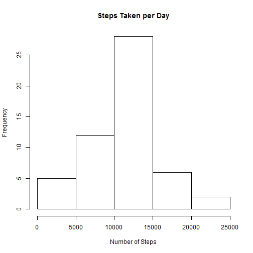
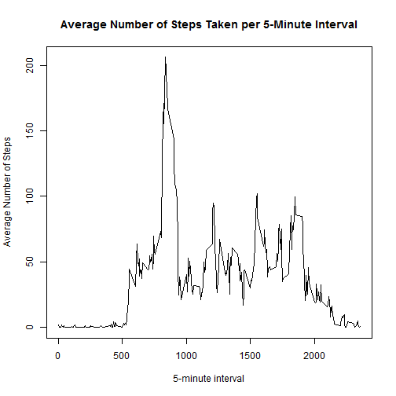
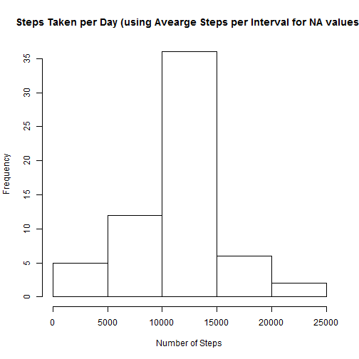
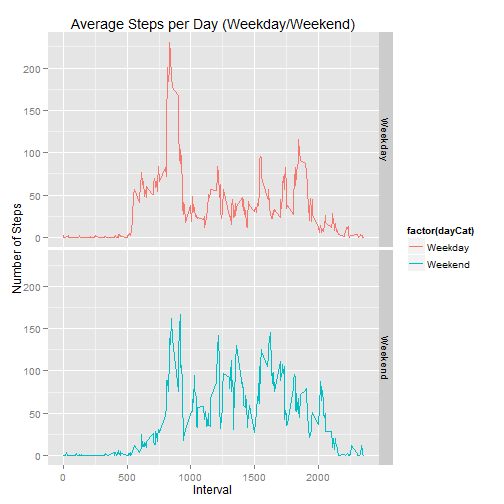

---
title: "Analyzing Daily Activity Patterns"
author: "J. Cichon"
date: "Friday, July 15, 2016"
output: html_document
---  


**Loading and preprocessing the data**        
  
1. Load data


```r
setwd("C:/R/ReproducibleResearch/")
df <- read.csv("activity.csv", header=TRUE, sep=",", na.strings="NA", 
               colClasses = c("integer", "Date", "integer" ))
```

2. Transform the data by removing NA values


```r
df_omit <- na.omit(df)
```

**What is mean total number of steps taken per day?**  

1. Calculate the total number of steps taken per day


```r
df_steps <- aggregate(steps ~ date, data = df_omit, sum)
```

2. Histogram of the total number of steps taken each day


```r
hist(df_steps$steps, main = "Steps Taken per Day", xlab = "Number of Steps")
```

 

3. Calculate and report the mean and median of the total number of steps taken per day


```r
mean_df <- mean(df_steps$steps)
median_df <- median(df_steps$steps)
```

The **mean** number of steps per day is: 

```r
mean_df
```

```
## [1] 10766.19
```
The **median** number of steps per day is: 

```r
median_df
```

```
## [1] 10765
```

**What is the average daily activity pattern?**

1. Plot of the 5-minute interval and the average number of steps taken, averaged across all days


```r
average_int <- aggregate(steps ~ interval,data = df_omit, mean)
plot(average_int$interval, average_int$steps, type = "l", main = "Average Number of Steps Taken per 5-Minute Interval",xlab = "5-minute interval", ylab = "Average Number of Steps")
```

 

2. Which 5-minute interval, on average across all the days in the dataset, contains the maximum number of steps?


```r
max_steps <- max(average_int$steps)
max_interval <- average_int$interval[which.max(average_int$steps)]
```

The **5-minute interval** that contains the maximum number of steps is: 

```r
max_interval
```

```
## [1] 835
```

**Inputing missing values**

1. Calculate and report the total number of missing values in the dataset


```r
df_missing <- is.na(df$steps)
df_missing_total <- sum(df_missing)
```

The **total number of missing values** is:

```r
df_missing_total
```

```
## [1] 2304
```

2. New dataset that is equal to the original dataset but with the missing data filled in


```r
df2 <- df
for (i in 1:nrow(df2)){
    if(is.na(df2$steps[i])){
        df2_interval <- df2$interval[i]
        avg_int_row <- which(average_int$interval == df2_interval)
        df2_steps <- average_int$steps[avg_int_row]
        df2$steps[i] <- df2_steps
    }
}
```
3. Histogram of the total number of steps taken each day and Calculate and report the mean and median total number of steps taken per day


```r
df2_steps <- aggregate(steps ~ date, data = df2, sum)
hist(df2_steps$step, main = "Steps Taken per Day (using Avearge Steps per Interval for NA values)", xlab = "Number of Steps")
```

 

Mean and Median steps for df2

```r
mean_df2 <- mean(df2_steps$steps)
median_df2 <- median(df2_steps$steps)
```
The **mean** number of steps taken per day is:

```r
mean_df2
```

```
## [1] 10766.19
```

The **median** number of steps taken per day is:

```r
median_df2
```

```
## [1] 10766.19
```

These values differ from the estimates in the first part of the assignment.  The mean stays the same since we are just replacing the NA values with the mean value.  The median matches the mean since we are adding 2,304 mean values for NA values.

**Are there differences in activity patterns between weekdays and weekends?**

1. New factor variable in the dataset with two levels - "weekday" and "weekend" indicating whether a given date is a weekday or weekend day


```r
df2$day <- weekdays(df2$date)
df2$dayCat <- "Weekday"
df2$dayCat[df2$day == "Saturday"| df2$day == "Sunday"] <- "Weekend"
```
2. Plot containing a time series plot of the 5-minute interval and the average number of steps taken, averaged across all weekday days or weekend days


```r
df2_steps_dayCat <- aggregate(steps ~ interval + dayCat, data = df2, mean)
library(ggplot2)
g<-ggplot(df2_steps_dayCat, aes(interval, steps))
g+geom_line (aes(color = factor(dayCat))) + facet_grid(dayCat ~.) + xlab("Interval")+ylab("Number of Steps")+ggtitle("Average Steps per Day (Weekday/Weekend)")
```

 


